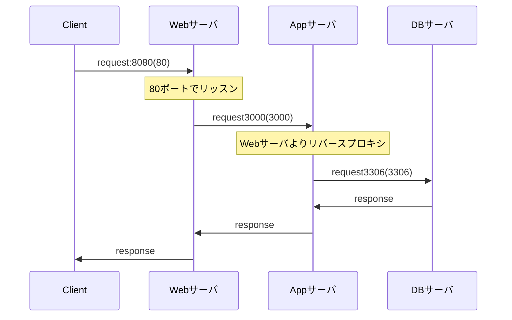

# README
rails6開発環境

- 以下構成にて動作します。
  - Webサーバ : nginx:1.18
    - 8080 -> 80ポートにフォワードします
      - 80ポート -> Appサーバ:3000 へリバースプロキシすることでAppサーバへリクエストします
  - DBサーバ : MySQL8.0
    - 3306 -> 3306ポートにフォワードします
  - Appサーバ : Ruby on Rails 6.1.6
    - 3000 -> 3000ポートにフォワードします



## ディレクトリ構成
```tree
.
├── Dockerfile
├── README.md
├── docker-compose.yml
├── forDocker
│   ├── mysql
│   │   └── conf.d
│   ├── nginx
│   │   └── default.conf
│   └── rails
│       └── entrypoint.sh
└── rails_app
    ├── Gemfile
    ├── Gemfile.lock
    ├── ... etc
```
- README.md
  - 本資料
- Dockerfile
  - rails6の実行環境イメージをビルドします
- docler-compose.yml
  - Webサーバ/DBサーバ/Appサーバとなるコンテナの設定を行います
- forDocker/mysql/conf.d
  - データベースの設定を行います
- forDocker/nginx/default.conf
  - Webサーバの設定を行います
- forDocker/rails/entrypoint.sh
  - rails6環境構築用のヘルパースクリプト

## 使い方
```
# 必要な資材のクローン
git clone https://github.com/km0723/rails6_sandbox
cd rails6_sandbox
git clone https://github.com/km0723/rails_app.git

# docker image及びcontainer作成
docker-compose build
docker-compose up -d

# db create
docker exec -it app bash
bundle exec rails db:create

# rails access
http://localhost:8080/

# vm起動
docker-compose up -d

# vm停止
docker-compose down

# 注意
docker-compose up -d の後railsが起動するまで時間がかかる場合があります。
その場合はしばらく時間をあけてから再度アクセスしてください。
```