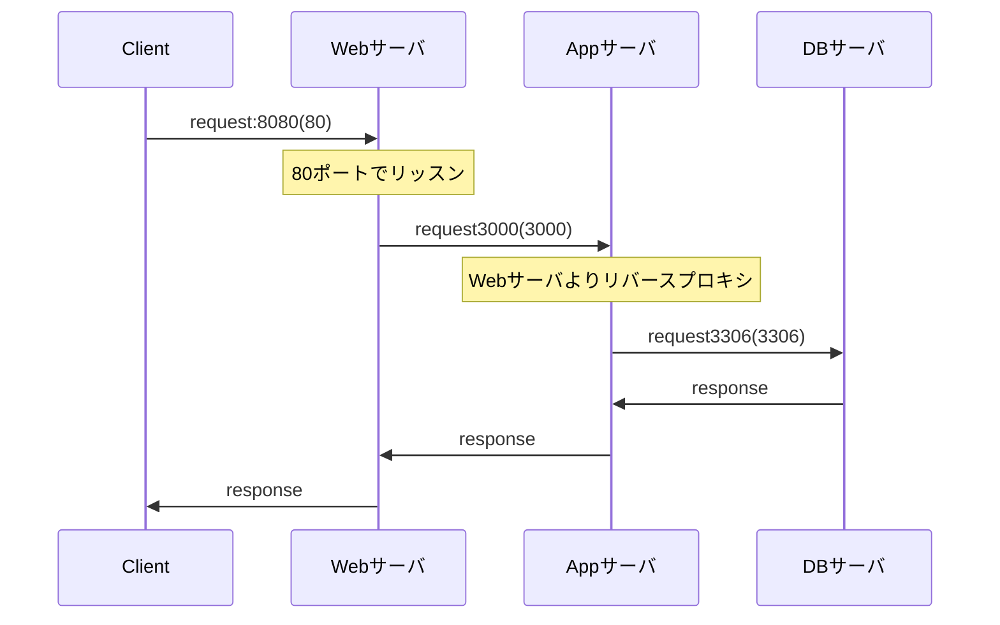

# README

- 以下構成にて動作します。
  - Webサーバ : nginx:1.18
    - 8080 -> 80ポートにフォワードします
      - 80ポート -> Appサーバ:3000 へリバースプロキシすることでAppサーバへリクエストします
  - DBサーバ : MySQL8.0
    - 3306 -> 3306ポートにフォワードします
  - Appサーバ : Ruby on Rails 6.1.6
    - 3000 -> 3000ポートにフォワードします



- ディレクトリ構成は以下の通り
```tree
.
├── Dockerfile
├── README.md
├── docker-compose.yml
├── forDocker
│   ├── mysql
│   │   └── conf.d
│   ├── nginx
│   │   └── default.conf
│   └── rails
│       └── entrypoint.sh
└── rails_app
    ├── Gemfile
    ├── Gemfile.lock
    ├── ... etc
```
- README.md
  - 本資料
- Dockerfile
  - rails6の実行環境イメージをビルドします
- docler-compose.yml
  - Webサーバ/DBサーバ/Appサーバとなるコンテナの設定を行います
- forDocker/mysql/conf.d
  - データベースの設定を行います
- forDocker/nginx/default.conf
  - Webサーバの設定を行います
- forDocker/rails/entrypoint.sh
  - rails6環境構築用のヘルパースクリプト
