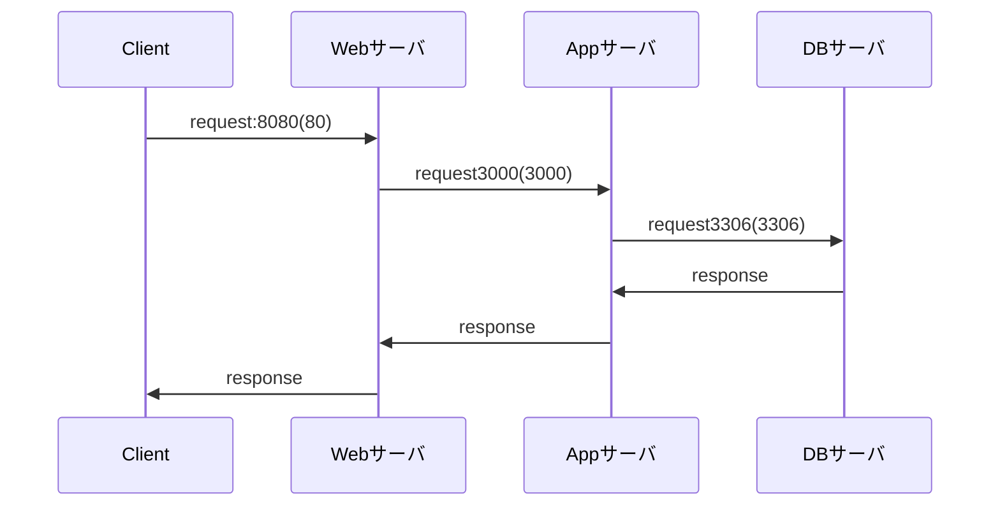

# README
rails6開発環境

- 以下構成にて動作します。
  - Webサーバ : nginx:1.18
    - 8080 -> 80ポートにフォワードします
      - 80ポート -> Appサーバ:3000へリクエストします
  - DBサーバ : MySQL8.0
    - 3306 -> 3306ポートにフォワードします
  - Appサーバ : Ruby on Rails 6.1.6
    - 3000 -> 3000ポートにフォワードします



## ディレクトリ構成
```tree
.
├── Dockerfile
├── README.md
├── docker-compose.yml
├── forDocker
    ├── mysql
    │   └── conf.d
    ├── nginx
    │   └── default.conf
    └── rails
        └── entrypoint.sh
```
- README.md
  - 本資料
- Dockerfile
  - rails6の実行環境イメージをビルドします
- docler-compose.yml
  - Webサーバ/DBサーバ/Appサーバとなるコンテナの設定を行います
- forDocker/mysql/conf.d
  - データベースの設定を行います
- forDocker/nginx/default.conf
  - Webサーバの設定を行います
- forDocker/rails/entrypoint.sh
  - rails6環境構築用のヘルパースクリプト
- rails_app
  - 上記構成には出てきませんがrailsアプリを配置します
  - コンテナとの共有フォルダとして使用します
  - 詳細は後述を参照

## 使い方
```
# 必要な資材のクローン
git clone https://github.com/km0723/rails6_sandbox
cd rails6_sandbox
git clone https://github.com/km0723/rails_app.git

# docker image及びcontainer作成
docker-compose build
docker-compose up -d

# db create
docker exec -it app bash
bundle exec rails db:create

# rails access
http://localhost:8080/

# コンテナ起動
docker-compose up -d

# コンテナ停止
docker-compose down

# 注意
docker-compose up -d の後railsが起動するまで時間がかかる場合があります。
その場合はしばらく時間をあけてから再度アクセスしてください。
```

## デバッグ方法
- appサーバ
  - [ruby-debug-ide](https://github.com/ruby-debug/ruby-debug-ide)にてrailsのデバッグができるよう
  以下ポートフォワード設定済みです。
    - 1234 -> 1234
    - 26162 -> 26162

  - `vscode`からデバッグするための設定手順については以下が参考になります。
    - https://qiita.com/nakazawaken1/items/f442e8c25f3025f8147f

